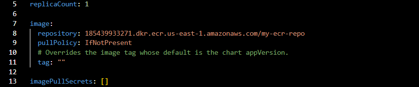

Deploy a springboot Java Application into an EKS (Elastic Kubernetes Service) cluster using Helm and a Jenkins Pipeline 

1. Push code into Version Control System (Github) - Application code, Jenkinsfile,Dockerfile and Helm Chart
2. Pushing to Github triggers Jenkins pipeline
3. Jenkins checks out the code from Github
4. Maven builds JAR file
5. Build Docker Image with dockerfile
6. Tag and push Docker Image to ECR
7. Deploy to EKS using Helm


Pre-requisites

1. EKS Cluster - Use eksctl to create cluster with 2 worker nodes

2. ECR Repository - Create one on AWS

3. Launch EC2 to act as our Jenkins server
- Install the following on our Jenkins server
   a. AWSCLI
   b. Helm
   c. Kubectl
   d. Docker
   e. eksctl
   f. Jenkins
   g. Maven


IMPLEMENTATION STEPS ARE AS FOLLOWS
- Create Github repo and constantly push our code from VSCode to Github repo (Application code, Jenkinsfile,Dockerfile and Helm Chart)
- Create Jenkins Server (EC2) and install all the necessary tools and applications as above
- Create an EKS cluster with 2 worker nodes in AWS using eksctl
- Create an ECR repository to host our docker image
- Create a Helm chart for our springboot application
- Update Helm chart to pull docker image in ECR
- Create kubeconfig credentials in Jenkins to interact with EKS cluster 
- Create Jenkins pipeline script for jenkinsfile
- Configure Jenkins to use Jenkinsfile from SCM
- Create Namespace for Helm deployment
- Deploy application into namespace in EKS
- Access application in browser using LoadBalancer url


CREATE JENKINS SERVER

Launch EC2

Name: Jenkins Server

AMI: Ubuntu 22.04 LTS

INSTANCE TYPE: t2.Large  (This isn't on the free tier and will cost you. We need enough RAM and CPU to install the pre-requisites) 


INSTALLATIONS ON EC2

INSTALL AWSCLI

```
curl "https://awscli.amazonaws.com/awscli-exe-linux-x86_64.zip" -o "awscliv2.zip" 

sudo apt install unzip

sudo unzip awscliv2.zip  

sudo ./aws/install

aws --version
```


INSTALL HELM
```
sudo apt update

curl -fsSL -o get_helm.sh https://raw.githubusercontent.com/helm/helm/master/scripts/get-helm-3

chmod +x get_helm.sh

sudo ./get_helm.sh
```
Check helm version

```
helm version
```


INSTALL KUBECTL

```
curl -s https://packages.cloud.google.com/apt/doc/apt-key.gpg | sudo apt-key add -

sudo touch /etc/apt/sources.list.d/kubernetes.list

echo "deb http://apt.kubernetes.io/ kubernetes-xenial main" | sudo tee -a /etc/apt/sources.list.d/kubernetes.list

sudo apt-get update

sudo apt-get install -y kubectl
```

VERIFY INSTALLATION

```
kubectl version --short --client
```


INSTALL EKSCTL

```
curl --silent --location "https://github.com/weaveworks/eksctl/releases/latest/download/eksctl_$(uname -s)_amd64.tar.gz" | tar xz -C /tmp
```
Move the extracted binary to /usr/local/bin. 
```
sudo mv /tmp/eksctl /usr/local/bin
```
VERIFY INSTALLATION
```
eksctl version
```


INSTALL DOCKER

Update local packages 
```
sudo apt update
```
```
Install the below packages```
sudo apt install gnupg2 pass -y
```
 
Install docker
```
sudo apt install docker.io -y
```

Add Ubuntu user to Docker group
```
sudo usermod -aG docker $USER
```
We need to reload shell in order to have new group settings applied. 
```
newgrp docker
```
The Docker service needs to be setup to run at startup. 
```
sudo systemctl start docker
sudo systemctl enable docker
```

Check the installation
```
sudo systemctl status docker
```


INSTALL JENKINS
```
wget -q -O - https://pkg.jenkins.io/debian-stable/jenkins.io.key |sudo gpg --dearmor -o /usr/share/keyrings/jenkins.gpg

sudo sh -c 'echo deb [signed-by=/usr/share/keyrings/jenkins.gpg] http://pkg.jenkins.io/debian-stable binary/ > /etc/apt/sources.list.d/jenkins.list'

sudo apt update

sudo apt install jenkins

sudo systemctl start jenkins.service
```

Check if Jenkins in running
```
sudo systemctl status jenkins
```


INSTALL DOCKER AND DOCKER PIPELINE PLUGIN AND ADD JENKINS USER TO DOCKER GROUP

```

Now Login to Jenkins > manage Jenkins > Available plugins and install
- Docker plugin
- Docker Pipeline plugin
```


Add jenkins user to Docker group
```
sudo usermod -a -G docker jenkins
```
Restart Jenkins service
```
sudo service jenkins restart
```
Reload system daemon files
```
sudo systemctl daemon-reload
```

Restart Docker service 
```
sudo service docker stop
sudo service docker start
```
Check the Docker status
```
sudo systemctl status docker
```


LETS CONFIGURE MAVEN PLUGIN THAT WILL BE USED IN OUR JENKINS PIPELINE

- We shall be using Maven for our build

Manage Jenkins > Tools > Maven > Add maven > Save

Go back into Manage Jenkis > Tools > Maven Installations
Set Maven name as Maven 3 and MAVEN_HOME as /usr/share/maven


CREATE HELM CHART AND MODIFY VALUES.YAML AND DEPLOYMENT.YAML

Let's go to the root of our springboot application omn our local machine. 

Create helm chart by executing the commands below
```
helm create mychart
```
```
tree mychart
```

Add Docker image details to download from ECR before deploying to EKS cluster
open mychart/values.yaml.


Add Docker image details to download image from ECR before deploying to EKS cluster
open mychart/values.yaml.

Edit repository : ImageName



Enter the service type as LoadBalancer


Next, open templates/deployment.yaml
and update containerPort to 8080 as springboot application


#### Save the files and push to our Github repo


CREATE EKS CLUSTER USING EKSCTL
#### We need to create Create IAM Role with Administrator Access

- Create an IAM role with AdministratorAccess policy.
- Go to AWS console > IAM > Roles. create a role
- Select AWS services, Click EC2, Click on Next permissions.
AdministratorAccess policy and select
- Name your role and create it

#### Next, we need to assign the created role to our Jenkins instance

 - Go to AWS console > EC2 > EC2 instance > Security

 - Click on Modify IAM Role

 - Choose the role we created from the dropdown and click on Apply.

Our Instance can now request services on our behalf

CREATE EKS CLUSTER WITH eksctl

Switch to Jenkins user
```
sudo su - jenkins
```
Run command to create EKS cluster with 2 worker nodes
```
eksctl create cluster --name demo-eks --region us-east-1 --nodegroup-name my-nodes --node-type t3.small --managed --nodes 2 
```


CREATE JENKINS PIPELINE

Dashboard > New Item > Enter Item name > Select Pipeline and click oK.


Let's configure the pipeline to use the Jenkinsfile from our github repository


#### Jenkinsfile

```
pipeline {
    
    tools {
        maven 'Maven3'
    }
    agent any
    
    environment {
        registry = "185439933271.dkr.ecr.us-east-1.amazonaws.com/my-ecr-repo"
    }
    stages {
        stage('Git Checkout') {
            steps {
               checkout scmGit(branches: [[name: '*/main']], extensions: [], userRemoteConfigs: [[url: 'https://github.com/deleonab/cicd-jenkins-docker-helm-kubernetes.git']])
            }
        }
        stage('Build Artifact') {
            steps {
               sh 'mvn clean install'
            }
        }
        stage('Build Docker Image') {
            steps {
               script{
                   dockerImage = docker.build registry
                   dockerImage.tag("$BUILD_NUMBER")
               }
            }
        }
        stage('Push Docker Image') {
            steps {
               script{
                   sh'aws ecr get-login-password --region us-east-1 | docker login --username AWS --password-stdin 185439933271.dkr.ecr.us-east-1.amazonaws.com'
                   sh'docker push 185439933271.dkr.ecr.us-east-1.amazonaws.com/my-ecr-repo:$BUILD_NUMBER'
               }
            }
        }
        stage('Helm Deployment') {
            steps {
               script{
                   sh"helm upgrade first --install mychart --namespace helm-deployment --set image.tag=$BUILD_NUMBER"
                  
               }
            }
        }
    } 
}

```


